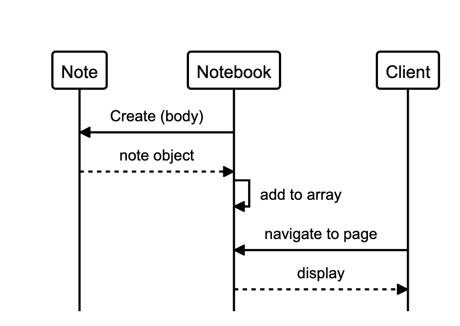

# notes_app

### [Makers Academy](http://www.makersacademy.com) - Week 7 Pair Group Project

Team members:
* [Arif Ebrahim](https://github.com/ArifEbrahim)
* [Merryn Hurley-Rawlins](https://github.com/merrynhr)
* [Zsuzsanna Ver](https://github.com/MrsVer)

This is a single-page notes app allowing users to create a note, and have it appear in a list of notes created that session. Notes will not persist beyond the user session.

The learning objectives for this week were:

* Build a dynamic single page app using only Pure JS
* Request and use data from an external API
* Explain that libraries are code

## User Stories
```
As a programmer
I can see a list of my notes, where each note is abbreviated to the first 20 characters
So I can find the one I want
```
```
As a programmer
I can create a new note
So I can record something I need to remember
```
```
As a programmer
I can see the full text of an individual note on its own page
So I can see all the information in the note
```
```
As a programmer
I can use shortcodes like `:fire:` that get converted into emojis like 🔥
So I can record notes with fun little pictures
```
```
As a programmer
I can refresh the page and still see my notes
So I can remember what I took down
```

## Domain Model




## Technologies

* Javascript
* HTML
* CSS

## Testing Framework

The repo includes a bespoke testing framework written from scratch.

## Frontend view (screenshot)